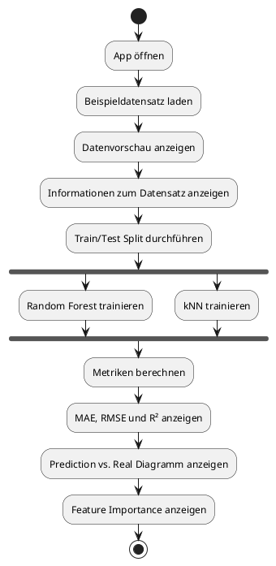
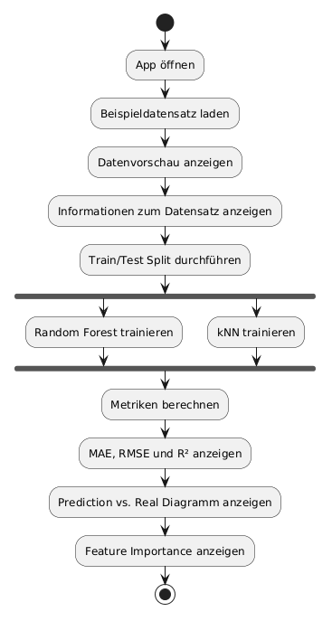

# App Flow

## Ziel

Diese Datei beschreibt den Ablauf der ML Regression App.

Die App soll zeigen, wie ein Datensatz geladen, verarbeitet, trainiert und bewertet wird.

## Hauptablauf

1. Der Nutzer öffnet die Web-App.
2. Die App lädt den Beispieldatensatz.
3. Die App zeigt eine Vorschau der Daten.
4. Die App zeigt einfache Informationen zum Datensatz.
5. Der Nutzer startet das Modelltraining.
6. Die App teilt die Daten in Trainingsdaten und Testdaten.
7. Die App trainiert ein Random-Forest-Modell.
8. Die App trainiert ein kNN-Modell.
9. Die App berechnet die Metriken MAE, RMSE und R².
10. Die App zeigt die Ergebnisse in einer Tabelle.
11. Die App zeigt Diagramme zur Modellbewertung.
12. Der Nutzer kann die Ergebnisse vergleichen.

## App-Ablauf als Liste

```text
App öffnen
↓
Datensatz laden
↓
Daten anzeigen
↓
Train/Test Split durchführen
↓
Random Forest trainieren
↓
kNN trainieren
↓
Metriken berechnen
↓
Ergebnisse anzeigen
↓
Diagramme anzeigen
```

## Ablaufdiagramm mit PlantUML




## Erste Version der App

In der ersten Version nutzt die App nur den Concrete-Datensatz.

Der Nutzer muss noch keine eigene Datei hochladen.

## Spätere Erweiterung

Später kann die App erweitert werden.

Mögliche Erweiterungen:

* CSV-Datei hochladen
* Zielvariable auswählen
* Modellparameter einstellen
* Ergebnisse exportieren
