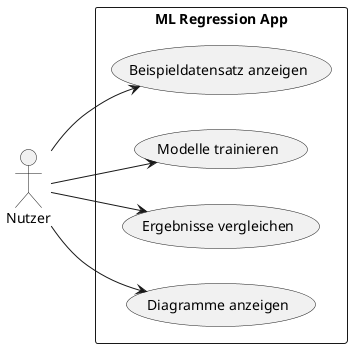
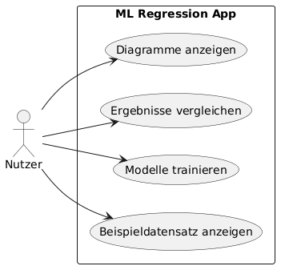

# Use Cases

## Ziel

Diese Datei beschreibt die wichtigsten Anwendungsfälle der ML Regression App.

## Akteur

* Nutzer

## Use Cases

### UC-01: Beispieldatensatz anzeigen

Der Nutzer öffnet die App und sieht den Concrete-Datensatz als Tabelle.

### UC-02: Modelle trainieren

Der Nutzer startet das Training von Random Forest und kNN.

### UC-03: Ergebnisse vergleichen

Der Nutzer sieht die Metriken MAE, RMSE und R² für beide Modelle.

### UC-04: Diagramme anzeigen

Der Nutzer sieht Diagramme wie Prediction vs. Real und Feature Importance.

## Use-Case-Diagramm

